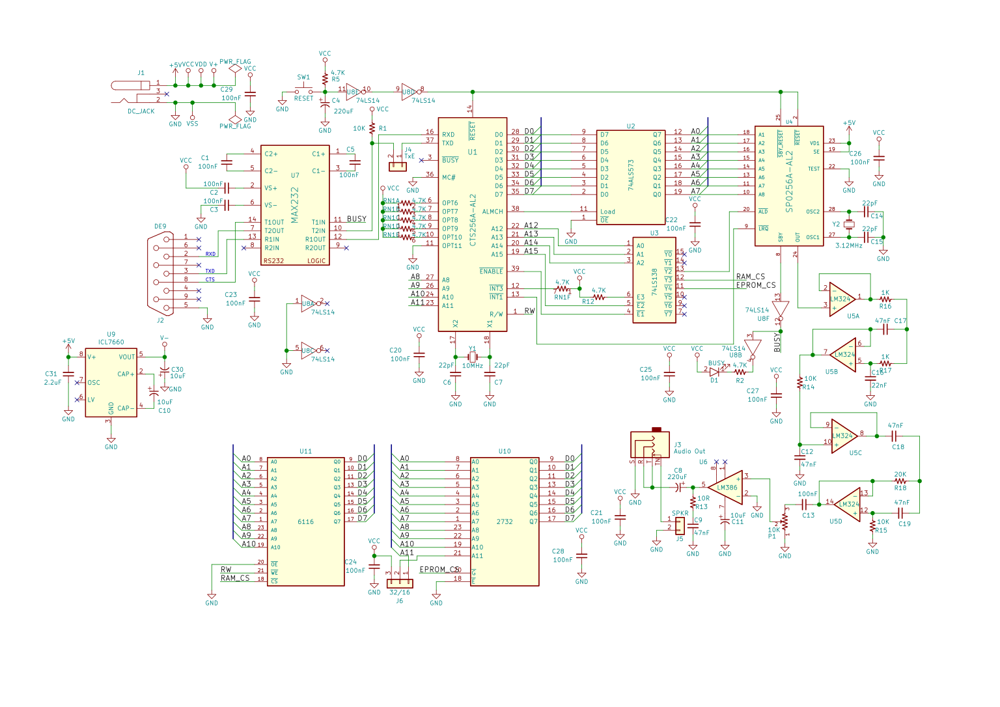

# General Instrument code to speech board

https://user-images.githubusercontent.com/2958269/232145730-0c889982-4ce1-40af-863f-1e8e2e9dcb7c.mp4

 

Quoted from [General Instrument Application Note 0505D: CTS256A-AL2 Code-to-Speech Chipset](https://bitsavers.computerhistory.org/components/gi/speech/General_Instrument_-_AN-0505D_-_CTS256A-AL2_Code-to-Speech_Chipset_-_10Dec1986.pdf)

> ## Description
> 
> The Code-to-Speech chip set consists of two chips: the SPO256A-AL2, an
> allophone-based single chip speech synthesizer, and the CTS256A-AL2, an
> 8-bit microcomputer programmed with a letter-to-sound based algorithm.
> This chip set translates English characters into LPC synthesized speech
> sounds.
> 
> ## SPO256-AL2
> 
> The SPO256-AL2 is General Instruments's standard allophone chip and is
> based on the SPO256A speech synthesizer. This synthesizer consists of a
> 10 or 12 pole second-order cascaded LPC filter, a controller, and a
> 16-bit ROM in which 59 allophones (speech sounds) and five pauses are
> stored.
> 
> ## CTS256A-AL2
> 
> The CRT256A-AL2 is a PIC7041 whose on-board ROM is masked with our
> code-to-speech algorithm. This algorithm converts English text (in the
> form of standard ASCII characters) into SPO256A-AL2 compatible allophone
> addresses, using letter-to-sound rules.

I honestly hadn't expected the level of interest that was shown in this
board when I posted it on [r/electronics](https://reddit.com/r/electronics).
So I hadn't prepared a repository. This effort is therefore a little
rushed, and I beg your forgiveness for any obvious in retrospect errors.

## Schematic

The schematic is based largely on the schematics included in the "Technical
Data" sheets that used to be stapled to the back of the Radio Shack
blister packs. They were also included in the Archer Semiconductor Reference
Guides, specifically the [1988 edition](https://archive.org/details/ArcherSemiconductorReferenceGuide1988).

Those schematics appear to have been based in turn on those included in
the aforementioned GI Application Note.

Since I wasn't expecting anyone else to want to use this, I've customised
the schematic to suit myself. There's no parallel port interface, and the
serial interface is programmed not by onboard DIP switches, but by the
contents of the exception word EPROM.

The active filter was cribbed directly from David C. Alford's article
in the [December 1985 issue of Micro Cornucopia, "Speech Generation With Radio Shack's SPO256"](https://archive.org/details/micro-cornucopia-magazine-1985-12).
Although I seemed to have it working well enough when I breadboarded the
circuit, the first version on the PCB was pretty horrible. It sounded like
it was clipping - a lot. It turned out to be a dumb mistake on my part.
Just because the LM324 is spec'd to work on a single supply, the circuit
wasn't designed for that. Without a negative supply, I was losing the 
entire negative half of the signal. How on earth I didn't hear that on
the breadboarded version, I have no idea. I toyed with the idea of 
pulling V- from the MAX232A and regulating it down to -5V; the current
requirements of the LM324 were modest enough I could have gotten away
with it. But I couldn't quickly find a through hole negative regulator
that didn't draw much more current than the LM324 would have. I had a
few ICL7660s in my parts box, so I went that route instead.

# The PCB

The board layout was inspired by the [CTS256A-AL2 Text-To-Speech Board](https://www.smbaker.com/cts256a-al2-text-to-speech-board).
It wasn't until I saw that one a couple of years back that I realized that
my oh-so-much-larger solderless breadboard version could be tamed into
something more reasonably sized.

In the [gerbers subdirectory](gerbers/), you'll find all the Gerber
files, as well as a zipped compilation suitable for submitting to
[JLCPCB](https://jlcpcb.com/), which is where I had my boards made.

# Parts List

Sch/PCB #|Detail
---------|------
U1|CTS256A-AL2 DIP40 600 mil
U2|74ALS573 DIP20 300 mil
U3|74LS138 DIP16 300 mil
U4|SP0256A-AL2 DIP28 600 mil
U5|LM324 DIP14 300 mil
U6|LM386 DIP8 300 mil
U7|MAX232 DIP16 300 mil
U8|74LS14 DIP14 300 mil
U9|ICL7660 DIP8 300 mil
U10|2716/32 2K/4Kx8 EPROM DIP24 600 mil
U11|6116 2Kx8 SRAM DIP24 600 mil
Y1|10MHz crystal HC49-U
Y2|3.12MHz crystal HC49-U (3.58MHz color burst crytal will work)
R1,R14, R15|10K 1/8W
R13|10 ohms 1/8W
R16,17|1K 1/8W
R18|20K 1/8W
R2,5,12|4.7K 1/8W
RN1|4.7K bussed resistor array (DigiKey# 4607X-101-472LF-ND)
C1,C2,C3, C5,C13, C20-C29|100nF ceramic capcitors, 0.1" lead spacing
C10,C11,C31|10uF electrolytic capacitors, 2mm lead spacing
C16|22nF ceramic capacitor, 0.1" lead spacing
C4,C8|220uF electrolytic capacitors, 2.5mm lead spacing
C6,C7, C14,C15|22pF ceramic capacitors, 2.5mm lead spacing
C9,C12, C17,C18, C19|47nF ceramic capacitors, 2.5mm lead spacing
C31|2.2uF tantalum capacitor, 0.1" lead spacing
D1|3mm LED
J1|DC Barrel 2.1mm Jack
J2|DSUB-9 Female Horizontal (Assmann A-DF 09 A-KG-T2S)
J3|3.5mm audio jack(CUI SJ1-3544)
J4|2 pin header, vertical, 0.1" lead spacing
J5|Molex KK-254 AE-6410-02A 2 pin header, 0.1" lead spacing
J6|3 pin header, vertical, 0.1" lead spacing
P1|10K audio taper pot (Bourns PTV111-1415A-A103)
SW1|SPST 6mm sq. tactile switch (CUI TS02-66-60-BK-100-LCR-D)
